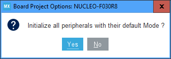
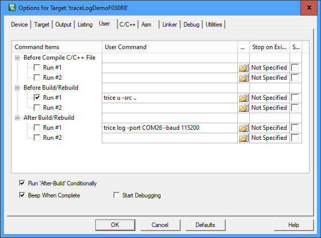

# TraceLog Demo Project NUCLEO-F030R8
## Prerequisites (as example)
- ST Microelectronic evaluation board NUCLEO-F030R8 or similar
  - costs about 10 EUR
- ST Microelectronic CubeMX
  - free
- ARMkeil IDE
  - free for small projects, also free license for some STM devices

## Demo Project setup steps (This is STM32 specific and shown here only for absolute beginners)

## CubeMx setup
  - New project, select NUCLEO-F030R8

     answer "Yes"
  - Enable USART2 interrupt: 
  
    
  - Select LL instead of HAL for USART: 
  
    
  - Necessary library files as reference: 

    
  - Set project name, location and toolchain: 
  
    
  - Adjust baudrate of UART2 if you like. In the example project 115200 is used.
  - Generate Code and open project: 
    
    

## ARMkeil IDE 
  - To see what to do compare these directories:
    - `./trice/testdata/generatedDemoF030R8`
    - `./trice/testdata/traceLogDemoF030R8`
  - some steps are:
      - Add `traceLog.c` to the project
      - Extend include path with traceLog folder
      - Edit project settings: 
      
        
      - Add to main: 
      
        
      
        
  
  - Connect evaluation board over USB with PC and detect the virtual COM port `trice log -port COMscan`