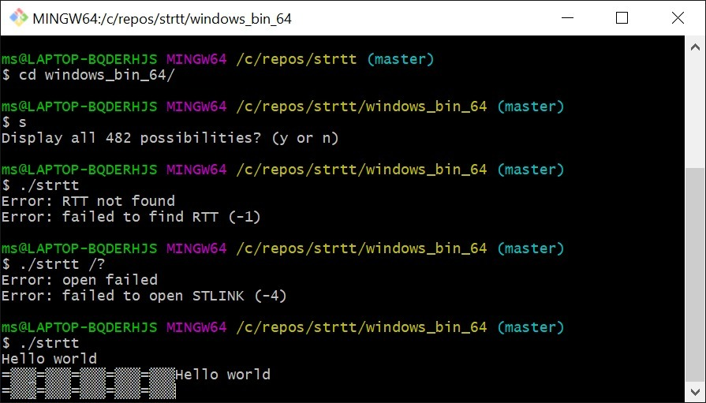

# Instruction Trace Macrocell (for M0+ and bigger MCUs)

- [https://github.com/robertlong13/SWO-Parser](https://github.com/robertlong13/SWO-Parser)

- [https://mcuoneclipse.com/2016/10/17/tutorial-using-single-wire-output-swo-with-arm-cortex-m-and-eclipse/](https://mcuoneclipse.com/2016/10/17/tutorial-using-single-wire-output-swo-with-arm-cortex-m-and-eclipse/)

- [https://interrupt.memfault.com/blog/a-deep-dive-into-arm-cortex-m-debug-interfaces](https://interrupt.memfault.com/blog/a-deep-dive-into-arm-cortex-m-debug-interfaces)

- [https://github.com/phryniszak/strtt](https://github.com/phryniszak/strtt)
- Ich habe ein Nucleo mit trice RTTD deflasht und auch den onboard J-Link von Segger ersetzte wieder mit ST-Link und einfach die https://github.com/phryniszak/strtt/blob/master/windows_bin_64/strtt.exe gestartet. Das Hello World ist Klartext, den ich mit SEGGER_Printf ausgegeben habe. Danach kommen ein paar trice-Messages...
  

Nolte:

Zu dem Info-Material:

 

ein einfaches Tracing sollte mit dem (onboard) J-Link und einer eclipse-basierten IDE möglich sein. (via Breakpoints setzen und Variableninhalte spezieller Tracevariablen auslesen…)

Für erweitertes Tracing eines nicht Modifizierten Projekts inklusive Live-Updates der Werte wird von ST folgende Soft- und Hardware empfohlen:

 

STM32CubeMonitor https://www.st.com/content/st_com/en/products/development-tools/software-development-tools/stm32-software-development-tools/stm32-performance-and-debuggers/stm32cubemonitor.html

Segger J-TRACER Pro for Cortex-M https://www.st.com/en/development-tools/j-trace-pro-for-cortex-m.html#product-details

 

J-Link ist ja wahrscheinlich schon vorhanden und ist einen ersten Versuch wert, da die ST-Software gratis ist.

(Alternativ dazu kann man sich ein eigenes Tool für den virtuellen COM-Port stricken)

 

ST ist ebenfalls auf github aktiv: https://github.com/STMicroelectronics

Für den STM32Cube gibt es expansion packages: https://www.st.com/en/embedded-software/stm32cube-expansion-packages.html#products

Die meisten packages sind kostenlos.

 