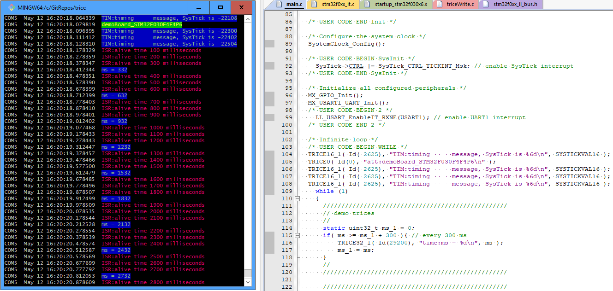

# Trice demo project info
## General Infos
### Compiler
- All in the example used compilers are free of charge for firmware images up to 32 KB size. An ARMKeil-MDK license is available for STM M0/M0+ cores free of charge also for bigger firmware images (256KB) but demands generally a paid license for non M0 cores.
- IAR works also for M4 for example but free only up to 32 KB images.
### triceConfig
- The examples are using mostly together the `triceConfig.h` inside `srcTrice.C` for more easy maintenance.
- Inside the project settings the TRICE_VARIANT is defined for the differences.
- Own projects should use a copy of `triceConfig.h` and modify it accordingly.
### Important Note for STM example projects
- The ST related DEMO projects are using the ST Microelectronics driver files version `STM32Cube_FW_F0_V1.11.0`.
- The driver files are as links inside the ST example projects.
- It is recommended to download the latet version of [STcubeMX](https://www.st.com/en/development-tools/stm32cubemx.html) and open the *.ioc files with it and generate again with the newest version.
- On Windows the ST firmware packages are installed usually in the user directory.
- You may need to adapt the paths in the project settings or put a copy into `C:\ST\CubeMX\STM32Cube_FW_F0_V1.11.0` to compile without changes.
  - To avoid any trouble you could remove the */Drivers/ directory, if any, and remove all drivers references from the project files before re-generating.
  - You may want to change the expected Firmware location and version.
### Encryption
- When enabling encryption the trice tool needs the commandline switch `-key test`, where `test` is the password for the examples
### Automatic update of trice ID list
- Before Build - User command: `trice u -src .. -src  ../../../srcTrice.C -list ../../til.json` should be counfigured with correct path locations
## Specific Infos
### demoBoard-STM32F030F4P6
- See [STM32F030F4P6-DEMO-BOARD](https://stm32-base.org/boards/STM32F030F4P6-STM32F030-DEMO-BOARD-V1.1.html) (same as No logo JF-Xuan STM32F030F4P6 Cortex M0 ARM 32 Bit 48MHz Core System Development Board) for hardware information
  - The board is very sensible against electro-static influence - be careful!
- The next 2 images show part of a NUCLEO-Board used only as ST-Link
  - The 2 jumpers at CN2 are removed
  - RED is 3.3V power supply
  - GREEN is Ground
  - YELLOW is SWCLK
  - ORANGE is SWDIO
  - BROWN is UART-TX out to UART-RX/RS232/USB/virtual UART (Ground cannection is over USB)
    - The small blue covered piece is s normal USB/Serial converter (FTDI)

- Using the ST-Link izt is possible to debug step the code
- An other option would be to download the HEX-File using the internal STM32 ROM-Bootloader over the USB/Serial converter. Then no ST-Link is needed but you can only run the code and not debug.
- Finally: The USB connector on the demoBoard-STM32F030F4P6 ist only used for power supply if no other connections.
## Not yet working (please ignore)
- triceDemo_NUCLEO-F070RB_Zephyr
- triceDemo_NUCLEO-F070RB_mbed
- Arduino
- blinky
- mbedIDE
- tryout
- mbed IDE

