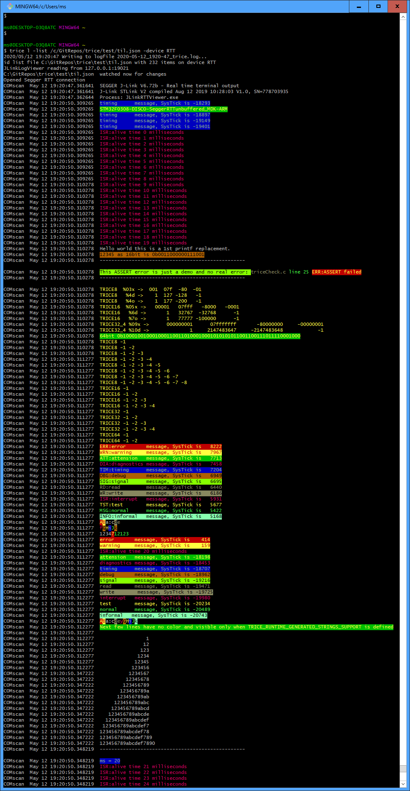
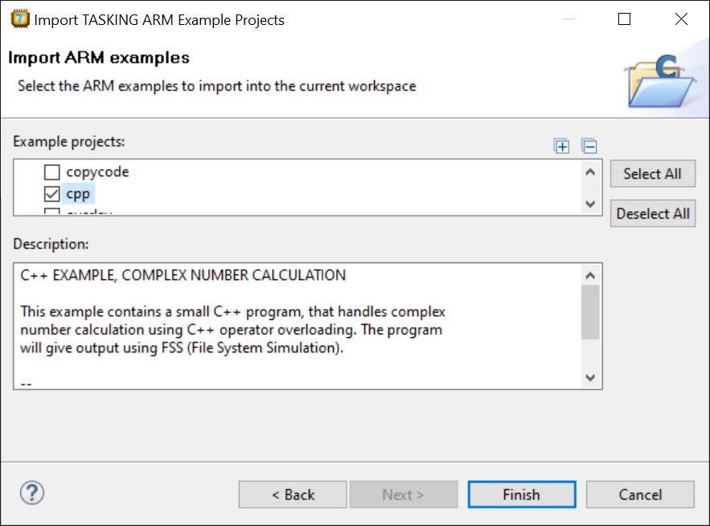
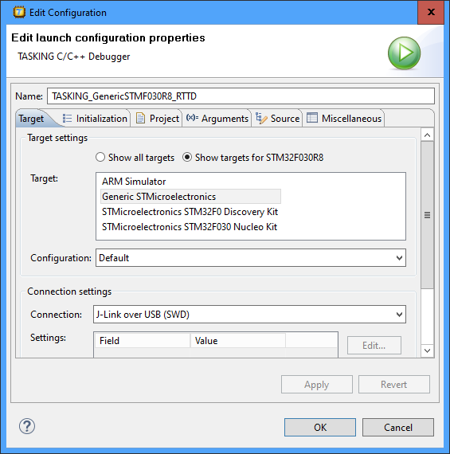
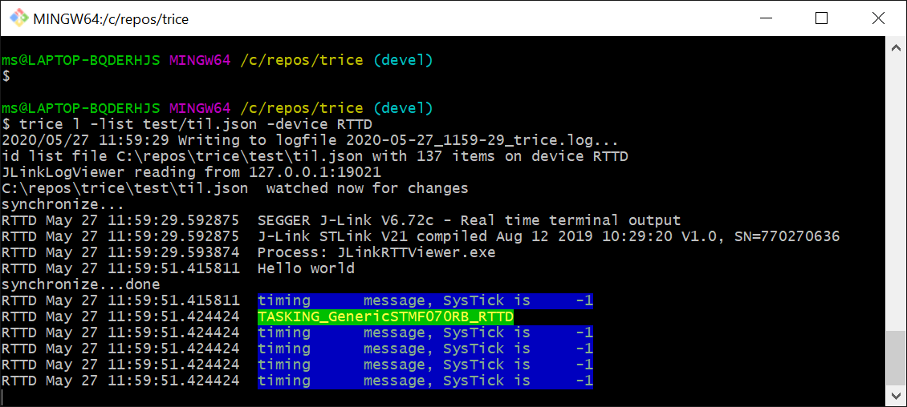
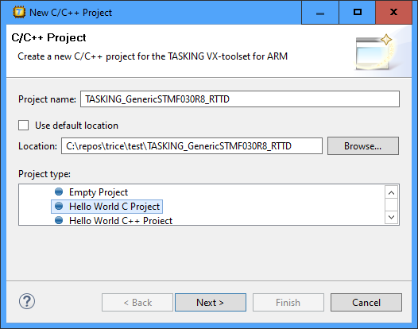
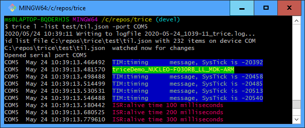

# Trice demo project info
## General Infos
## Third party
- SEGGER_RTT_V672b referenced source code by *SeggerRTT* projects

### Compiler
- All in the example used compilers are free of charge for firmware images up to 32 KB size, if not otherwise stated. An ARMKeil-MDK license is available for STM M0/M0+ cores free of charge also for bigger firmware images (256KB) but demands generally a paid license for non M0 cores.
- IAR works also for M4 for example but free only up to 32 KB images.

### trice configuration
- The examples are using mostly together the `triceConfig.h` inside `srcTrice.C` for more easy maintenance.
- Inside the project settings the TRICE_VARIANT is defined for the differences.
- Own projects should use a copy of `triceConfig.h` and modify it accordingly.

### Important Note for STM example projects
- The ST evaluation boards usually com with an on-board ST-Link probe (firmware).
- The example projects are configured for on-board J-Link firmware. 
  - One can either re-configure the examples for ST-Link usage or reflash the own board with J-Link on-board debug firmware. The way back is always open. If the Segger flash tool does not recognize the ST-Link firmware use the ST-Link tool to reflash with the 2nd option.
- The ST related DEMO projects are using the ST Microelectronics driver files version `STM32Cube_FW_F0_V1.11.0`.
- The driver files are as links inside the ST example projects.
- It is recommended to download the latet version of [STcubeMX](https://www.st.com/en/development-tools/stm32cubemx.html) and open the *.ioc files with it and generate again with the newest version.
- On Windows the ST firmware packages are installed usually in the user directory.
- You may need to adapt the paths in the project settings or put a copy into `C:\ST\CubeMX\STM32Cube_FW_F0_V1.11.0` to compile without changes.
  - To avoid any trouble you could remove the */Drivers/ directory, if any, and remove all drivers references from the project files before re-generating.
  - You may want to change the expected Firmware location and version.

### Encryption
- When enabling encryption the trice tool needs the commandline switch `-key test`, where `test` is the password for the examples

### Automatic update of trice ID list
- Before Build - User command: `trice u -src .. -src  ../../../srcTrice.C -list ../../til.json` should be counfigured with correct path locations

## Specific Infos (alphabetical order)

### Arduino (WIP)
- install arduino-cli

### demoBoard-STM32F030F4P6 
- ~100 clocks (without time optimization)
- See [STM32F030F4P6-DEMO-BOARD](https://stm32-base.org/boards/STM32F030F4P6-STM32F030-DEMO-BOARD-V1.1.html) (same as No logo JF-Xuan STM32F030F4P6 Cortex M0 ARM 32 Bit 48MHz Core System Development Board) for hardware information
  - The board is very sensible against electro-static influence - be careful!
- The next 2 images show part of a NUCLEO-Board used only as ST-Link
  - The 2 jumpers at CN2 are removed
  - RED is 3.3V power supply
  - GREEN is Ground
  - YELLOW is SWCLK
  - ORANGE is SWDIO
  - BROWN is UART-TX out to UART-RX/RS232/USB/virtual UART (Ground cannection is over USB)
    - The small blue covered piece is s normal USB/Serial converter (FTDI)
- photo: 
- photo: 
- output: 
- photo: 
- Using the ST-Link it is possible to debug step the code
- An other option would be to download the HEX-File using the internal STM32 ROM-Bootloader over the USB/Serial converter. Then no ST-Link is needed but you can only run the code and not debug.
- Finally: The USB connector on the demoBoard-STM32F030F4P6 ist only used for power supply if no other connections.

### generatedDemo_NUCLEO-F030R8_LL_MDK-ARM (ok)
- This is *without* TRICE instrumentation and ment for easy comparing to see quickly thw intrumentation needs with
  - triceDemo_NUCLEO-F030R8_LL_MDK-ARM
  - triceDemo_NUCLEO-F030RB_LL_IAR_EWARM
  - triceDemo_NUCLEO-F030RB_LL_SeggerRTT_IAR_EWARM
  - triceDemo_NUCLEO-F030RB_LL_STM32CubeIDE
  - triceDemo_NUCLEO-F030RB_LL_SeggerRTT_MDK-ARM

### PICkit-44-Pin-DEMO-Board_PIC18F45K20 (WIP)
- Download & install [MPLAB-X IDE](https://www.microchip.com/mplab/mplab-x-ide)
  - install Plugin MPLAB Code-generator [https://www.microchip.com/mplab/mplab-code-configurator](https://www.microchip.com/mplab/mplab-code-configurator)
- [PIC_C-Compilervergleich](https://www.mikrocontroller.net/articles/PIC_C-Compilervergleich)
- Download & install XC8 compiler [XC8 compiler](https://www.microchip.com/mplab/compilers) 
  - FREE version will do.
- pdf: [PICkit 3 Debug Express PIC18F45K20 - MPLAB C Lessons.pdf](../third_party/PICkit-44-Pin-DEMO-Board_PIC18F45K20PICkit 3 Debug Express PIC18F45K20 - MPLAB C Lessons.pdf)
- photo: 
- schematic: 
- [PICkit 3 Debug Express Lessons.zip](../third_party/PICkit%203%20Debug%20Express%20Lessons.zip)
- photo: 
- [PIC18F45K20 overview](https://www.microchip.com/wwwproducts/en/PIC18F45K20)

### STM32F4-Discovery (WIP)
- Get the firmware from [STM32F4-Discovery_FW_V1.1.0](https://www.st.com/en/embedded-software/stsw-stm32068.html)
- ARM-MDK does not translate this in free verion

### STM32F0300-DISCO_SeggerRTT_MDK-ARM 
- ~250 ticks
- Inside the SysTickISR each millisecond a TRICE message is produced and every 20 milliseconds the full test bunch runs.
- The ISR:alive @20ms message is visible at about 2 3rd of the screen
- SeggerRTT gets the messages every 10ms. Therefore with is traffic the internal buffer is needed to be 7KB. Normally you get away with much less RAM needs.
- Output: 

### STM32F0300-DISCO_SeggerRTTD_MDK-ARM (needs check)

### TASKING
#### TASKING_cpp-Example
- Import TASKING C/C++ -> TASKING ARM Example Projects -> cpp Project

- Next steps like first steps in [TASKING_STM32F4DISC_Audio_Service](#TASKING_STM32F4DISC_Audio_Service)
#### TASKING_STM32F4DISC_Audio_Service

- Project is now inside .workspace folder
- Delete Project inside the IDE but not the project itself
- Move the Project out of .workspace and rename it to TASKING_STM32F4DISC_Audio_Service
- Import existin project and **do not** copy it into workspace
#### TASKING_GenericSTMF030R8_RTT

#### TASKING_GenericSTMF030R8_RTTD

- Build and check if Debug works:

- Add New Source Folder SeggerRTT
- Import -> General -> Filesystem
  - Check "Create Top-Level Folder" and Advanced -> "Create Links in Workspace")

- Add path 

- Edit 
- Start Debug & J-Link Viewer and run:

- Add New Source Folder srcTrice.C
- Import -> General -> Filesystem
  - Check "Create Top-Level Folder" and Advanced -> "Create Links in Workspace")

- specify in project settings:
  - TRICE_VARIANT=SEGGER_RTT
  - TRICE_PUSH=triceDirectWrite

#### TASKING_GenericSTMF070RB_RTTD

- Start TASKING ARM Eclipse IDE with some workspace
- File -> New -> TASKING Arm Project -> Hello Worls C Project
- [ ] Uncheck "Use default location"

- -> Next, select processor hardware & 
- [x] check "Add startup file(s) to the project"
- Select as target "Generic STMicroelectronics. This will allow you to 
- Right-Click on Project -> New -> Tasking Software Platform Document -> Generate Code
- Add Software Services and Device Stacks
- Needs ST-Link "STM32Debug+VCP" and **NOT** "STM32Debug+Mass storage+VCP" (change with ST-Link utility)
- Needs to ignore this:

### triceDemo_NUCLEO-F030R8_HAL_MDK-ARM
- ~19 clocks

### triceDemo_NUCLEO-F030R8_LL_MDK-ARM
- ~27 clocks

### triceDemo_NUCLEO-F030RB_LL_IAR_EWARM (ok)

### triceDemo_NUCLEO-F030RB_LL_SeggerRTT_IAR_EWARM (ok)

### triceDemo_NUCLEO-F030RB_LL_SeggerRTT_MDK-ARM (ok)

### triceDemo_NUCLEO-F030RB_LL_STM32CubeIDE (ok)

### triceDemo_NUCLEO-F070RB_HAL_IAR_EWARM (ok)

### triceDemo_NUCLEO-F070RB_HAL_MDK-ARM (ok)

### triceDemo_NUCLEO-F070RB_HAL_STM32CubeIDE (ok)

### triceDemo_NUCLEO-F070RB_LL_IAR_EWARM (ok)

### triceDemo_NUCLEO-F070RB_LL_MDK-ARM (ok)

### triceDemo_NUCLEO-F070RB_LL_SeggerRTT_MDK-ARM (ok)

### triceDemo_NUCLEO-F070RB_LL_SeggerRTTD_MDK-ARM 
- ~ 270 clocks: This is significant slower than with RTT but still so fast, that it is ok for many cases.
- The main advantage here is, that the trices go directly out and need no triceServe in target code.
- The SEGGER-write function is optimizable for speed in special cases.

### triceDemo_NUCLEO-F070RB_LL_STM32CubeIDE (ok)

### triceDemoPIC18F45K20 (WIP)

### LPC800
- [LPC800frontside](./README.media/LPC800frontside.jpg)
- [LPC800fbackside](./README.media/LPC800backside.jpg)
- [https://community.nxp.com/community/general-purpose-mcus/lpc/blog/2017/03/20/lpc800-dip-schematic](https://community.nxp.com/community/general-purpose-mcus/lpc/blog/2017/03/20/lpc800-dip-schematic)
- Device  LPC824M201JHI33  (or alternatively LPC834M101FHI33)
- [www.silabs.com/products/mcu/Pages/USBtoUARTBridgeVCPDrivers.aspx](www.silabs.com/products/mcu/Pages/USBtoUARTBridgeVCPDrivers.aspx)
- [https://mcuoneclipse.com/2017/05/13/mcuxpresso-ide-blinky-the-nxp-lpc800-dip-board/](https://mcuoneclipse.com/2017/05/13/mcuxpresso-ide-blinky-the-nxp-lpc800-dip-board/)
- Download, install & start Xpresso
- Press Download and install SDKs

### triceDemo_NUCLEO-F070RB_Zephyr
### triceDemo_NUCLEO-F070RB_mbed
### blinky
### mbedIDE
### tryout
### mbed IDE
