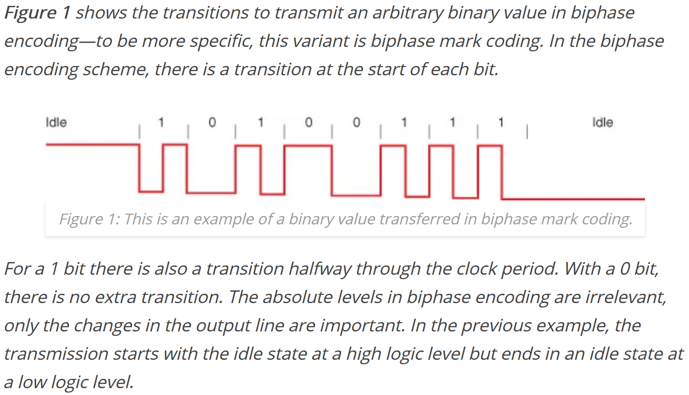
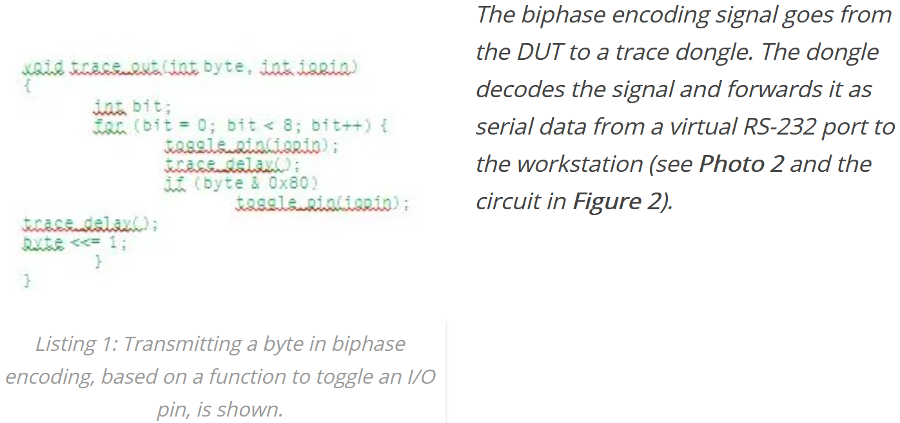

# How to use *Trice* without UART

> _(Read only you are interested in)_

Because the **trice** tool needs only to receive, a single target UART-TX pin will do. But it is also possible to use a GPIO-Pin for *Trice* messages without occupying a UART resource.

- This slow path is usable because a *Trice* needs only few bytes for transmission.
- You can transmit each basic trice (4 or 8 bytes) as bare message over one pin:

  
  

- The 2 images are taken from [https://circuitcellar.com/cc-blog/a-trace-tool-for-embedded-systems/](https://circuitcellar.com/cc-blog/a-trace-tool-for-embedded-systems/). See there for more information.
- As *Trice* dongle you can use any spare MCU board with an UART together with an FTDI USB converter.
  - This allowes also any other data path - method does'nt matter:\
  [UART](https://en.wikipedia.org/wiki/Universal_asynchronous_receiver-transmitter),\
  [I²C](https://en.wikipedia.org/wiki/I%C2%B2C),\
  [SPI](https://en.wikipedia.org/wiki/Serial_Peripheral_Interface),\
  [GPIO](https://circuitcellar.com/cc-blog/a-trace-tool-for-embedded-systems/),\
  [CAN](https://en.wikipedia.org/wiki/CAN_bus),\
  [LIN](https://en.wikipedia.org/wiki/Local_Interconnect_Network), ...
- [RTT](https://www.segger.com/products/debug-probes/j-link/technology/about-real-time-transfer/) is also a possible path to use - see [Segger RTT](./TriceOverRTT.md) for options.